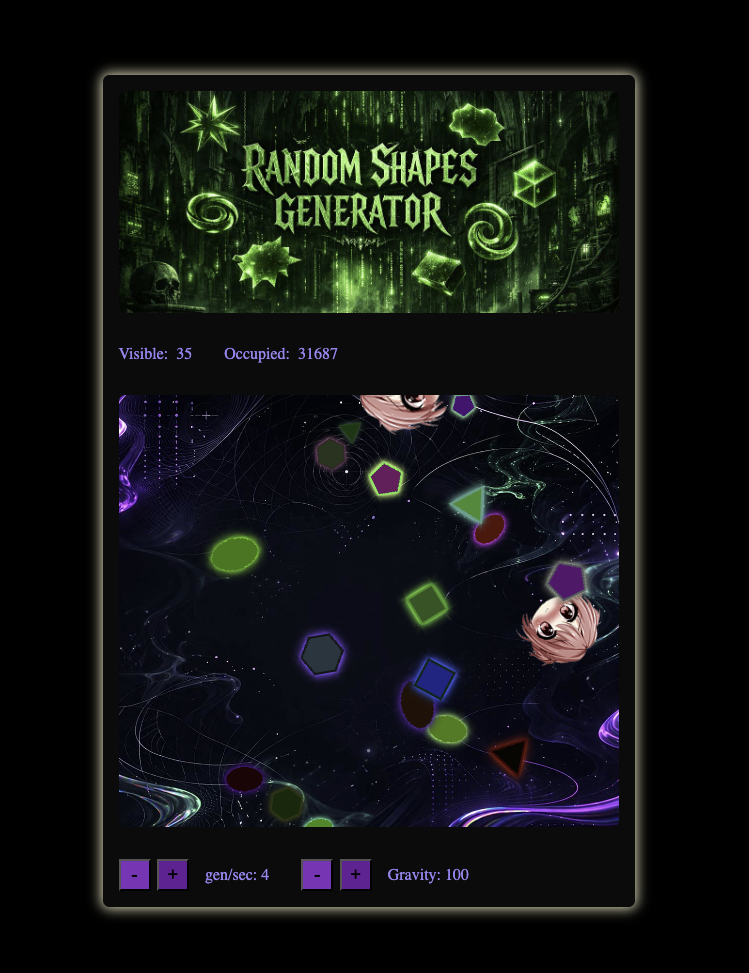

# Falling Shapes

Screenshot:



A small Vue + TypeScript + PixiJS demo that renders animated falling shapes, supports click interactions, random colors, sound effects, and a small control panel for gravity / generation rate.

## Stack

- Vue 3 + TypeScript
- Vite
- PixiJS
- GSAP
- `pixi-filters`
- `@pixi/sound`

## Local development

1. Install dependencies:

```bash
npm install
```

2. Start the dev server:

```bash
npm run dev
```

3. Open the local URL printed by Vite in the terminal.

## Production build

Create an optimized production build:

```bash
npm run build
```

Preview the built app locally:

```bash
npm run preview
```

The production output is generated in the `dist/` folder.

## Deployment

This project is a static frontend app, so the `dist/` folder can be deployed to any static hosting provider.

### Generic static hosting flow

1. Build the project:

```bash
npm run build
```

2. Upload the contents of `dist/` to your hosting provider.

3. Configure the host to serve `index.html` for unknown routes if you later add client-side routing.

### Examples

- **Vercel / Netlify**: connect the repo and use:
  - Build command: `npm run build`
  - Output directory: `dist`
- **GitHub Pages**: publish the built `dist/` folder.
- **Nginx**: serve the `dist/` directory as static files.

## Notes

- Audio assets are imported from the app source, so they are bundled during the normal Vite build.
- The Pixi scene is initialized from the Vue component on mount and exposes a small API back to Vue for settings and live stats.
- The app currently exposes controls for gravity and generated shapes per second.
